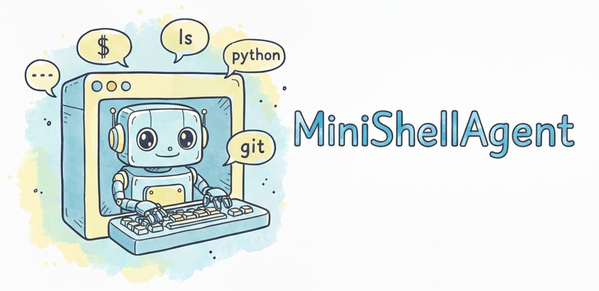

# MiniShellAgent
[](https://www.python.org/) [](LICENSE)
<div align="center">
  
</div>

## 简介

MiniShellAgent 是一个轻量级的命令行工具Agent，利用大语言模型为你的终端操作提供智能支持。它支持命令补全、自然语言交互和自动化任务执行，让命令行操作更加高效和直观。

MiniShellAgent遵循轻量、高效、简洁的设计理念。没有复杂的配置和臃肿的依赖，只保留核心功能。


## 特性

- **轻量设计** - 核心代码简洁，易于理解和修改
- **命令补全模式** - 基于历史记录和上下文智能补全命令
- **聊天模式** - 与 AI 进行自然语言对话，获取命令行帮助
- **智能代理模式** - 自动理解任务并执行相应的命令
  - 交互式模式：执行前确认，安全可控
  - 自动模式：全自动执行，高效便捷
- **安全保护** - 内置危险命令检测，防止误操作
- **优雅界面** - 彩色输出，清晰的交互体验
- **灵活配置** - 支持 OpenAI 兼容 API 和本地 Llama 模型

## 快速开始

### 安装

1. **克隆仓库**
   ```bash
   git clone <repository-url>
   cd homework1
   ```

2. **安装依赖**
   ```bash
   pip install -r requirements.txt
   ```

3. **运行安装脚本**
   ```bash
   python3 install.py
   ```

4. **配置环境变量**
   ```bash
   cp env.example .env
   # 编辑 .env 文件，填入你的 API Key
   ```

5. **重新加载 shell 配置**
   ```bash
   source ~/.zshrc  # 或 source ~/.bashrc
   ```

### 使用方法

**最简单的方式**：直接输入 `minishellagent` 启动，然后输入 `/help` 查看帮助。

```bash
minishellagent
```

启动后，你可以：

- 直接输入任务描述，Agent 会自动理解并执行
- 输入 `/help` 查看所有可用命令
- 输入 `/chat`、`/agent`、`/complete` 切换工作模式
- 输入 `/exit` 退出程序

#### 命令行参数（可选）

如果需要指定模式或配置，可以使用命令行参数：

```bash
# 指定模式
minishellagent --mode agent

# 指定任务（单次执行）
minishellagent --mode agent --task "帮我创建一个新的 Python 项目"

# 使用本地模型
minishellagent --llm llama --mode agent
```

### 配置选项

通过环境变量或 `.env` 文件配置：

```bash
# OpenAI 兼容 API 配置（支持任何兼容 OpenAI API 格式的服务）
OPENAI_API_KEY=your_api_key_here
OPENAI_BASE_URL=https://api.openai.com/v1  # 或你的 API 服务地址
OPENAI_MODEL=gpt-5-mini

# 本地 Llama 配置（可选）
LLAMA_MODEL_PATH=/path/to/model.gguf
LLAMA_N_CTX=4096
LLAMA_N_GPU_LAYERS=0

# Agent 配置
MAX_STEPS=10
MAX_IDLE_STEPS=2
SAFE_MODE=true
```

**注意**：MiniShellAgent 支持任何兼容 OpenAI API 格式的服务，包括：
- OpenAI 官方 API
- DeepSeek、Moonshot 等国内服务
- 自部署的 OpenAI 兼容服务（如 vLLM、Ollama 等）

## 项目结构

```
homework1/
├── minishellagent/          # 核心模块
│   ├── __init__.py         # 包初始化
│   ├── main.py             # 主入口
│   ├── agents.py           # Agent 实现
│   ├── models.py           # LLM 模型封装
│   ├── tools.py            # 终端工具
│   ├── prompts.py          # 提示词模板
│   ├── config.py           # 配置管理
│   └── ui.py               # 用户界面
├── install.py              # 安装脚本
├── requirements.txt        # 依赖列表
├── env.example             # 配置示例
└── README.md              # 项目文档
```

## 系统兼容性

MiniShellAgent 对不同的操作系统提供了不同程度的支持：

###  完全支持

- **macOS** - 经过完整测试，所有功能正常工作
- **Linux** - 经过完整测试，所有功能正常工作

###  部分支持

- **Windows** - 代码中包含了 Windows 支持，但**未经过详细测试**，可能存在以下问题：
  - 命令执行可能无法实时显示输出
  - 某些功能可能表现异常

  **建议**：在 Windows 系统中使用 **WSL (Windows Subsystem for Linux)** 来获得最佳体验。WSL 提供了完整的 Linux 环境，可以完美运行 MiniShellAgent 的所有功能。

### 在 Windows 中使用 WSL

如果你使用的是 Windows 系统，推荐通过 WSL 使用：

1. **安装 WSL**（如果尚未安装）：
   ```powershell
   wsl --install
   ```

2. **在 WSL 中安装 MiniShellAgent**：
   ```bash
   # 在 WSL 终端中
   git clone <repository-url>
   cd homework1
   pip install -r requirements.txt
   python3 install.py
   ```

3. **使用方式与 Linux 完全相同**

## 使用示例

### 示例 1: 直接启动使用

```bash
$ minishellagent

MiniShellAgent v0.1.0
当前模式: Agent模式 - 智能执行命令

输入 /help 查看帮助

> 帮我统计当前目录下所有 .py 文件的行数

[Agent] 理解任务：统计 Python 文件行数
[Agent] 执行：find . -name "*.py" -type f | xargs wc -l
[Agent] 任务完成！
```

### 示例 2: 命令补全模式

```bash
$ minishellagent --mode complete

> 查看系统内存
建议的命令：
1. free -h
2. top -l 1 | grep PhysMem
3. vm_stat
```

### 示例 3: 聊天模式

```bash
$ minishellagent --mode chat

> 如何批量重命名文件？
[Assistant] 可以使用 `rename` 命令或 `for` 循环...
```

## 安全说明

MiniShellAgent 内置了多层安全保护机制：

- 危险命令检测（如 `rm -rf /`）
- 执行前确认（交互式模式）
- 工作目录隔离
- 命令历史记录

**注意**：使用自动模式时请谨慎，确保理解命令的执行后果。

## 贡献

欢迎提交 Issue 和 Pull Request！

## 许可证

本项目采用 MIT 许可证。

## 致谢

本项目受到了以下优秀项目的启发和影响：

- **[smolagents](https://github.com/huggingface/smolagents)** - 一个轻量级的 AI Agent 框架，为本项目的 Agent 架构设计提供了重要参考
- **[mini-swe-agent](https://github.com/SWE-agent/mini-swe-agent)** - 一个简洁、高效的软件工程 Agent 实现，为本项目的工具调用和执行机制提供了灵感
- **Claude Code** - 本项目的界面设计借鉴了其交互体验和视觉风格

感谢这些项目为开源社区做出的贡献！

---

<div align="center">

**Made with passion by Haotian Ren**

北京邮电大学 | 操作系统课程作业

</div>
